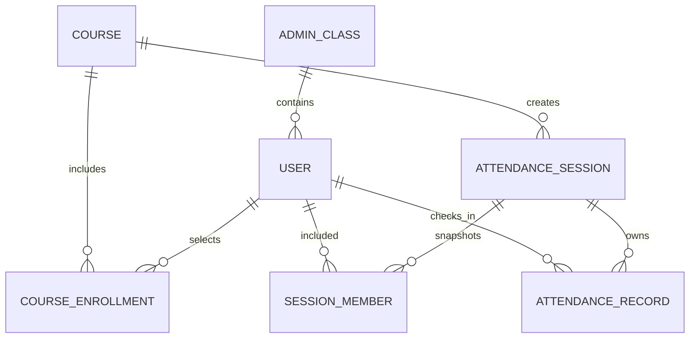

# FaceCheck：一起刷脸签到

## 1. 项目概述

FaceCheck 是一款面向课堂考勤场景的 HarmonyOS 原生应用。教师可在华为 Pad 上维护班级、课程和学生信息，录入学生人脸，并通过人脸检测、人脸比对和可选的交互式活体检测完成签到。

项目采用端侧处理方案，核心业务数据、人脸照片和签到记录均保存在应用沙箱中，不依赖 Python 服务或外部服务器，适合课程演示、离线测试和小规模课堂考勤。

当前应用版本：`1.1.0`

应用包名：`com.example.facecheck`

支持设备类型：HarmonyOS 手机、平板

## 2. 技术栈

| 层级 | 技术 |
| --- | --- |
| 开发语言 | ArkTS |
| 开发工具 | DevEco Studio |
| UI 框架 | ArkUI |
| 应用模型 | Stage 模型、UIAbility |
| 人脸检测与比对 | HarmonyOS Core Vision Kit |
| 活体检测 | HarmonyOS Vision Kit Interactive Liveness |
| 图像处理 | Image Kit、PixelMap |
| 拍照能力 | 系统 Camera Picker |
| 数据持久化 | ArkData RelationalStore |
| 设置持久化 | Preferences |
| AI 辅助开发 | CodeGenie、Codex |

Python 和 Web 人脸识别项目仅用于参考业务流程、数据模型和交互设计，未直接运行在 Pad 中。设备端的人脸能力由 HarmonyOS 原生 Kit 实现。

## 3. 已完成功能

### 3.1 教学组织

- 创建和管理行政班级。
- 创建和管理课程。
- 将学生归属到一个行政班级。
- 为学生关联一门或多门课程。
- 使用归档方式停用人员、班级和课程，保留历史记录。

### 3.2 人员管理

- 新增、编辑、搜索和归档学生。
- 展示学号、姓名、班级及人脸录入状态。
- 人脸录入完成后，返回人员管理页会立即刷新为“已录入人脸”。
- 支持重新录入并替换旧的人脸照片。

### 3.3 人脸录入

录入流程如下：

1. 选择待录入学生。
2. 调用前置相机拍摄照片。
3. 使用 Core Vision Kit 检测人脸。
4. 校验是否存在人脸、是否为单人以及是否为正面人脸。
5. 将合格照片保存至应用沙箱。
6. 更新数据库中的人脸照片路径和录入状态。

### 3.4 签到场次

- 选择课程并发起签到场次。
- 创建场次时，将该课程当前选课学生复制为本场应到名单快照。
- 后续学生转班、退课或资料变化不会影响历史场次。
- 可配置迟到判定时间。
- 同一学生在同一场次中不能重复签到。
- 可手动结束当前场次。

### 3.5 刷脸签到

签到流程如下：

1. 检查当前签到场次和所选学生。
2. 检查学生是否属于本场应到名单。
3. 检查学生是否已录入人脸。
4. 启用活体检测时，先完成交互式活体检测。
5. 获取现场人脸图像。
6. 使用 Core Vision Kit 检测现场图像质量。
7. 加载注册照片并进行 1:1 人脸比对。
8. 同时使用官方匹配结果和应用设置中的阈值判定。
9. 判定正常签到或迟到，并写入签到记录。
10. 更新本场统计和实时签到动态。

### 3.6 活体检测

- 使用 `interactiveLiveness` 官方接口。
- 启动前检查相机权限。
- 活体检测期间自动切换为竖屏，以满足组件运行要求。
- 检测结束、失败或取消后恢复进入检测前的屏幕方向。
- 获取活体检测结果和 PixelMap，并继续执行人脸比对。
- 活体检测可在设置页面开启或关闭。

活体检测依赖设备型号、HarmonyOS 版本和 Vision Kit 能力。若设备不支持，应用会给出失败提示，关闭活体检测后仍可使用普通人脸签到。

### 3.7 实时签到动态

- 成功和失败的签到尝试都会显示在实时动态中。
- 横屏时显示在签到页右侧。
- 横屏列表支持手势上下滑动和滚动条浏览。
- Pad 竖屏时显示在左下方空白区域。
- 窄屏设备使用紧凑型滚动动态条。
- 失败动态只用于现场反馈，不会写入正式考勤记录。

### 3.8 统计与记录

- 展示应到、已签到、迟到、未签到和出勤率。
- 从其他页面返回签到页后，统计数字会自动重新加载并响应式刷新。
- 支持查看历史签到记录。
- 支持按条件筛选记录。
- 支持导出签到数据。

### 3.9 设置与隐私

- 配置人脸比对阈值。
- 配置迟到时间。
- 开启或关闭活体检测。
- 清理人脸及考勤隐私数据。
- 应用仅申请运行期间的相机权限。

## 4. 数据关系



核心数据表：

| 表名 | 用途 |
| --- | --- |
| `users` | 学生资料、人脸照片路径和录入状态 |
| `admin_classes` | 行政班级 |
| `courses` | 课程 |
| `course_enrollments` | 学生与课程的多对多关系 |
| `attendance_sessions` | 签到场次 |
| `session_members` | 场次应到名单快照 |
| `attendance_records` | 正式签到记录 |

本场应到人数取自 `session_members`，实际签到人数取自 `attendance_records`，因此统计不会被后续人员资料调整破坏。

## 5. 项目结构

```text
entry/src/main/ets/
├── entryability/       应用入口与初始化
├── pages/              签到、人员、教学组织、记录和设置页面
├── components/         底部导航等公共组件
├── kits/               相机、人脸和活体能力适配层
├── services/           用户、考勤、组织、导出和设置业务
├── database/           数据库管理及 DAO
├── models/             数据模型
└── utils/              日志、日期和考勤规则
```

其中 `kits` 层封装 HarmonyOS 官方能力，页面不直接操作底层 AI 接口；`services` 层负责业务规则；`database` 层负责数据读写。

## 6. 响应式布局

应用使用 `mediaquery` 根据窗口宽度切换布局：

| 宽度 | 布局 |
| --- | --- |
| `< 600vp` | 手机或窄竖屏，单列布局 |
| `600vp - 839vp` | Pad 竖屏，中等宽度布局 |
| `>= 840vp` | Pad 横屏，三栏布局 |

横屏签到页由本场信息、应到人员和实时动态三部分组成；竖屏会重新排列内容，不是简单缩放横屏页面。正常页面支持横竖屏切换，活体检测阶段临时锁定竖屏。

## 7. 编译与运行

### 7.1 环境要求

- DevEco Studio 6.x。
- HarmonyOS SDK 6.x。
- 支持 HarmonyOS 的手机或 Pad。
- 设备已开启开发者模式和 USB 调试。
- 首次运行需授予相机权限。

### 7.2 DevEco Studio 运行

1. 使用 DevEco Studio 打开项目根目录。
2. 等待依赖同步和索引完成。
3. 连接华为 Pad，并确认设备可被识别。
4. 选择 `entry` 模块和 `default` 产品。
5. 点击 Run 编译并安装应用。

### 7.3 命令行构建

```powershell
$env:DEVECO_SDK_HOME='F:\DevEco Studio\sdk'
& 'F:\DevEco Studio\tools\hvigor\bin\hvigorw.bat' assembleHap `
  --mode module `
  -p module=entry@default `
  -p product=default `
  -p buildMode=debug `
  --no-daemon
```

签名 HAP 输出位置：

```text
entry/build/default/outputs/default/entry-default-signed.hap
```

## 8. 推荐演示流程

1. 在“教学”页面创建班级和课程。
2. 在“人员”页面新增学生并绑定班级、课程。
3. 为学生录入正面人脸照片。
4. 返回人员页，确认状态显示为“已录入人脸”。
5. 在“签到”页面选择课程并发起场次。
6. 选择学生进行普通刷脸签到。
7. 在设置中开启活体检测，再演示活体签到。
8. 展示签到成功、失败提示和实时动态。
9. 切换横竖屏，展示响应式布局。
10. 查看本场统计、历史记录和导出结果。

## 9. 测试要点

- 无人脸、多人脸和侧脸照片应被拒绝录入。
- 未录入人脸的学生不能签到。
- 非本场应到学生不能签到。
- 同一场次重复签到应被拒绝。
- 匹配分数低于阈值时应签到失败。
- 活体失败或取消后不能写入正式记录。
- 返回人员页后，人脸录入状态应立即刷新。
- 从其他页面返回签到页后，本场统计应立即刷新。
- 横竖屏切换后数据、选择状态和布局应保持正常。
- 实时动态数量较多时应能通过滚动条浏览。

## 10. 已知边界

- 当前实现为选择学生后的 1:1 人脸验证，不是对全班进行 1:N 自动识别。
- 人脸照片保存在应用沙箱中，卸载应用或清除应用数据后会丢失。
- 人脸识别结果受光照、拍摄角度、遮挡、相机质量和注册照片质量影响。
- 活体检测是否可用取决于真实设备及系统能力，模拟器通常无法完整验证。
- 本项目适合教学演示和小规模考勤，不应直接作为高安全级身份认证系统使用。

## 11. 隐私说明

人脸属于敏感个人信息。使用应用前应取得被录入人员授权，并说明采集目的、保存位置和删除方式。项目默认在设备本地处理人脸数据，不主动上传网络。测试结束后，可通过设置页面清理人脸照片和考勤数据。

## 12. 当前交付状态

当前版本已经完成核心课程要求：

- 用户信息注册与展示。
- 人脸录入与检测。
- 刷脸签到与人脸比对验证。
- 交互式活体检测。
- 签到记录查看与数据持久化。
- 班级、课程和场次名单快照。
- 横竖屏响应式布局。
- 实时签到动态与统计刷新。

项目已通过 ArkTS 编译，并已在连接的华为 Pad 上完成多轮安装和功能测试。
