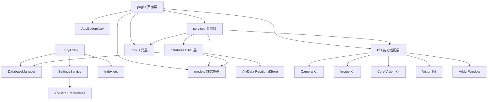
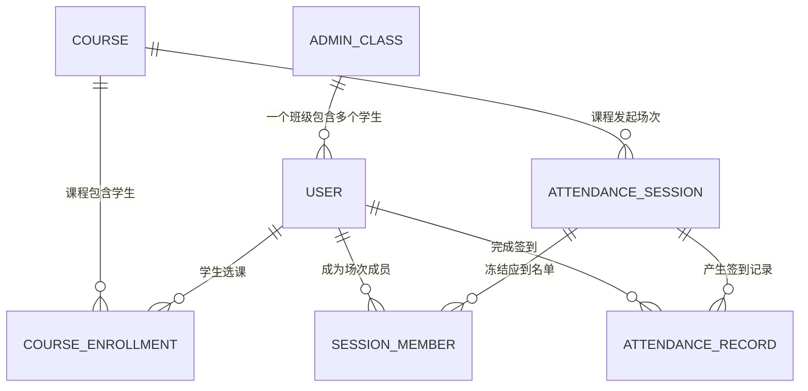
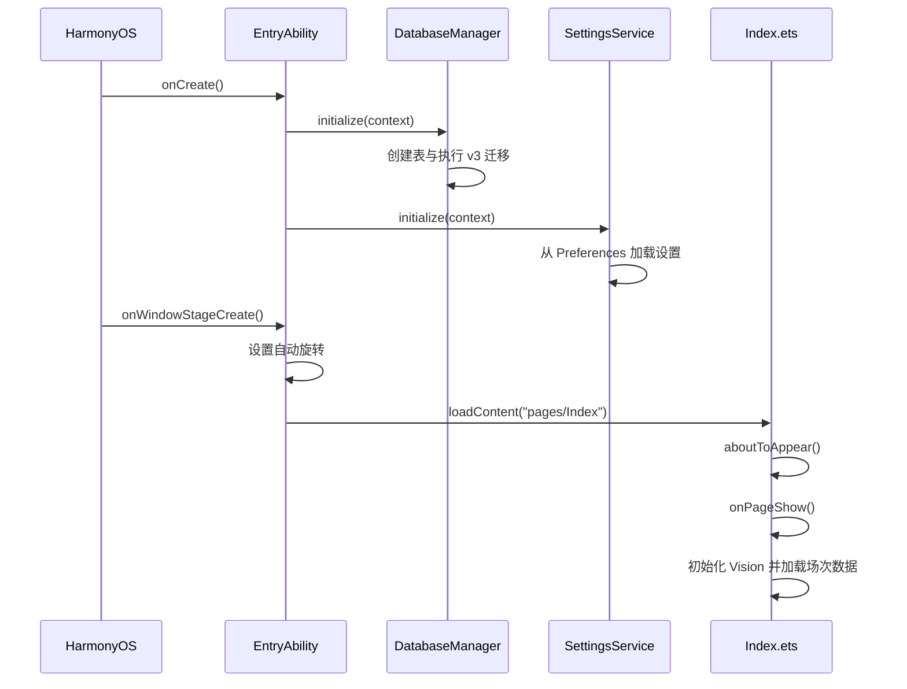
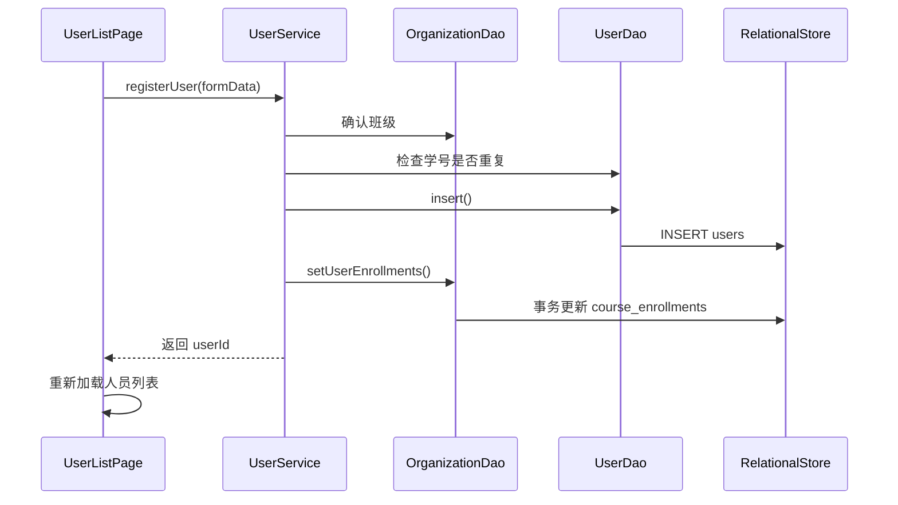
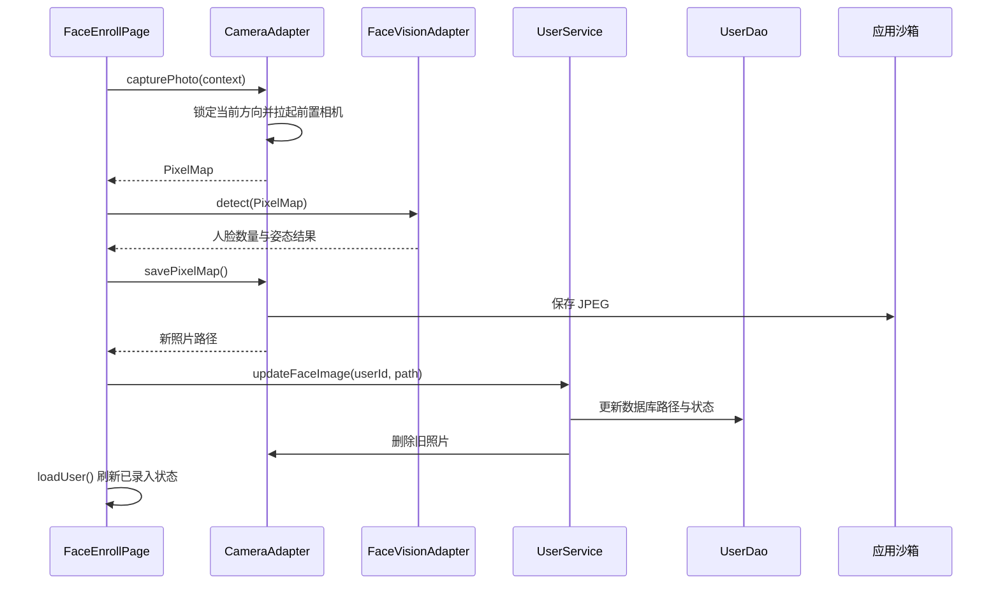
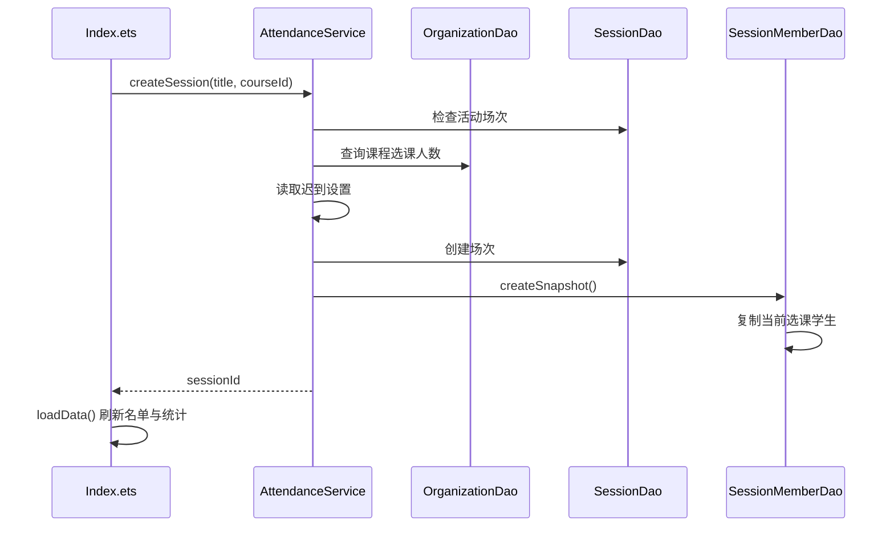
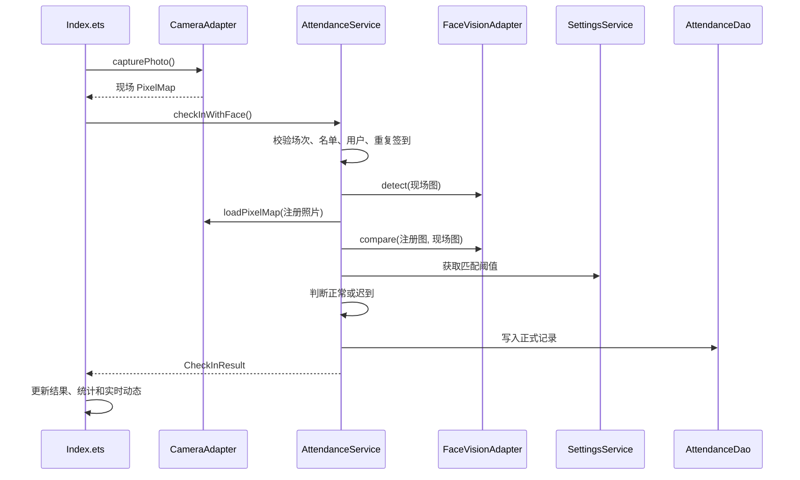
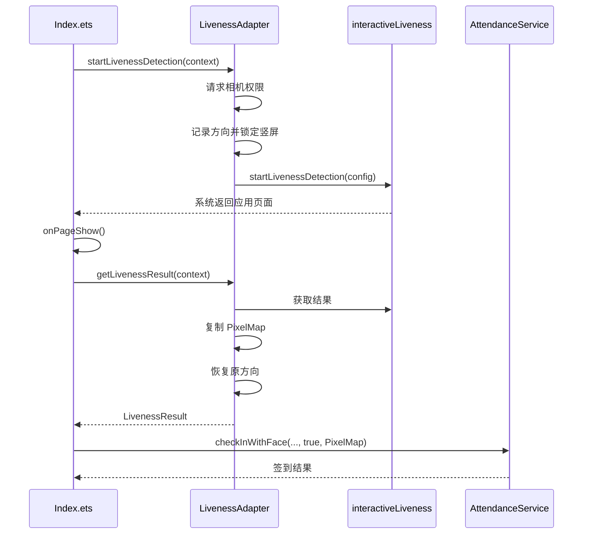
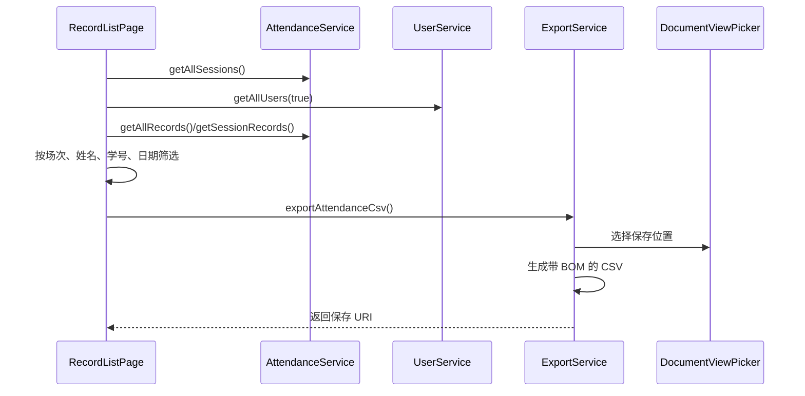
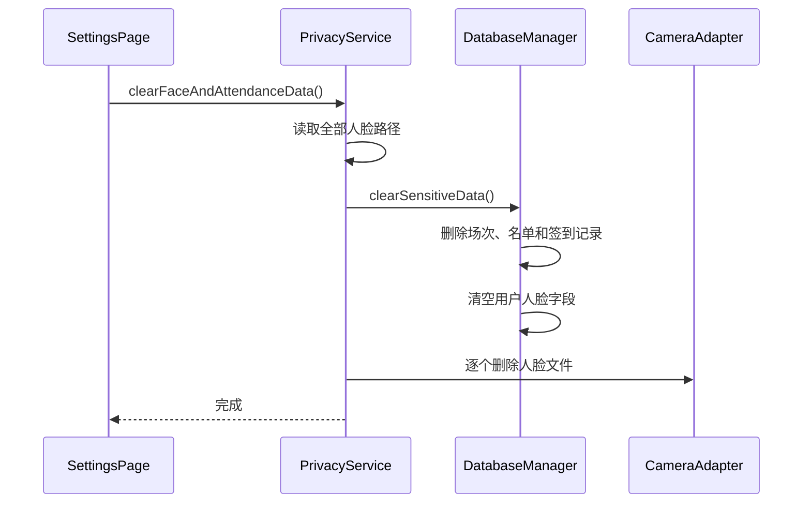

# FaceCheck 项目文件结构、依赖关系与业务流程详解

## 1. 文档目的

本文基于 FaceCheck 最终项目代码编写，用于回答以下问题：

- 项目由哪些目录和文件组成。
- 每个文件负责什么功能。
- 页面、业务服务、数据库和 HarmonyOS Kit 如何互相依赖。
- 应用启动、人脸录入、活体检测、刷脸签到、统计刷新、记录导出等流程如何运行。
- 修改某项功能时，应从哪些文件开始定位。

当前应用版本为 `1.1.0`，包名为 `com.example.facecheck`，支持 HarmonyOS 手机和平板。

## 2. 总体架构

项目采用分层结构：

```text
ArkUI 页面层
    ↓
业务 Service 层
    ↓
DAO 数据访问层 / Kit 能力适配层
    ↓
ArkData 数据库 / Preferences / Camera Kit / Core Vision Kit / Vision Kit
```

各层职责如下：

| 层级 | 目录 | 职责 |
| --- | --- | --- |
| 应用入口 | `entryability/` | 初始化数据库和设置，创建窗口并加载首页 |
| 页面层 | `pages/` | 管理界面状态、用户交互、响应式布局和流程编排 |
| 公共组件 | `components/` | 提供跨页面复用的 UI 组件 |
| 业务层 | `services/` | 校验业务规则，组合 DAO 和 Kit，提供页面可调用的业务接口 |
| 数据访问层 | `database/` | 创建数据库、执行 SQL、映射数据模型 |
| 系统能力适配层 | `kits/` | 封装相机、人脸检测、人脸比对和活体检测 |
| 数据模型层 | `models/` | 定义各层共享的数据结构和状态枚举 |
| 工具层 | `utils/` | 日期格式化、考勤规则和日志输出 |
| 资源层 | `resources/` | 字符串、颜色、图标、页面清单和备份配置 |
| 测试层 | `src/test`、`src/ohosTest` | 纯逻辑单元测试和设备测试入口 |

核心设计原则是：页面不直接执行 SQL，DAO 不处理业务决策，HarmonyOS AI API 统一由适配器封装。

## 3. 完整目录结构

```text
FaceCheck/
├── .gitignore
├── README.md
├── build-profile.example.json5
├── code-linter.json5
├── hvigorfile.ts
├── oh-package.json5
├── oh-package-lock.json5
├── AppScope/
│   ├── app.json5
│   └── resources/base/
│       ├── element/string.json
│       └── media/
│           ├── background.png
│           ├── foreground.png
│           └── layered_image.json
├── hvigor/
│   └── hvigor-config.json5
├── dev-md/
│   ├── Building FaceCheck HarmonyOS Application.md
│   ├── FaceCheck-v1.1-优化交付说明.md
│   ├── FaceCheck-项目完整说明.md
│   ├── FaceCheck-项目文件结构与依赖流程详解.md
│   ├── HarmonyOS_ArkTS开发规范与最佳实践.md
│   ├── dev plan.md
│   ├── modify.md
│   ├── 核心部分人脸功能的实现说明.md
│   └── 鸿蒙应用开发发布完整指南.md
└── entry/
    ├── .gitignore
    ├── build-profile.json5
    ├── hvigorfile.ts
    ├── obfuscation-rules.txt
    ├── oh-package.json5
    └── src/
        ├── main/
        │   ├── module.json5
        │   ├── ets/
        │   │   ├── components/
        │   │   ├── database/
        │   │   ├── entryability/
        │   │   ├── entrybackupability/
        │   │   ├── kits/
        │   │   ├── models/
        │   │   ├── pages/
        │   │   ├── services/
        │   │   └── utils/
        │   └── resources/
        ├── mock/
        ├── test/
        └── ohosTest/
```

本地还会生成 `build/`、`.hvigor/`、`oh_modules/`、`.idea/`、签名配置和真机截图，这些内容不属于源码，已由 `.gitignore` 排除。

## 4. 模块依赖关系

### 4.1 依赖方向



### 4.2 页面与服务依赖表

| 页面 | 直接依赖的业务/能力 |
| --- | --- |
| `Index.ets` | `AttendanceService`、`UserService`、`OrganizationService`、`SettingsService`、`CameraAdapter`、`FaceVisionAdapter`、`LivenessAdapter` |
| `UserListPage.ets` | `UserService`、`OrganizationService` |
| `FaceEnrollPage.ets` | `UserService`、`CameraAdapter`、`FaceVisionAdapter` |
| `OrganizationPage.ets` | `OrganizationService` |
| `RecordListPage.ets` | `AttendanceService`、`UserService`、`ExportService` |
| `SettingsPage.ets` | `SettingsService`、`PrivacyService` |

### 4.3 Service 与底层依赖表

| Service | DAO/Kit 依赖 |
| --- | --- |
| `UserService` | `UserDao`、`OrganizationDao`、`CameraAdapter` |
| `OrganizationService` | `OrganizationDao`、`UserDao` |
| `AttendanceService` | `AttendanceDao`、`SessionDao`、`SessionMemberDao`、`UserDao`、`OrganizationDao`、`FaceVisionAdapter`、`CameraAdapter`、`SettingsService` |
| `SettingsService` | `Preferences` |
| `ExportService` | `DocumentViewPicker`、`fileIo` |
| `PrivacyService` | `DatabaseManager`、`UserDao`、`CameraAdapter` |

## 5. 根目录文件说明

### 5.1 `.gitignore`

控制 Git 忽略规则，重点排除：

- `oh_modules/`、`node_modules/`、构建缓存和 IDE 配置。
- 本机 `local.properties`。
- 实际签名配置 `build-profile.json5`。
- `.p12`、`.p7b`、`.cer`、`.key` 等证书和密钥文件。
- HAP 构建产物。
- 本地数据库、日志和 CSV 导出结果。
- 可能包含姓名、学号或人脸信息的真机截图。

该文件保证公开仓库不包含本机路径、签名密码和测试隐私数据。

### 5.2 `README.md`

GitHub 项目首页，提供项目简介、主要功能、技术栈、运行方式、隐私提示和详细文档入口。

它面向第一次打开仓库的开发者，不承担完整代码解释职责。

### 5.3 `build-profile.example.json5`

根项目构建配置模板，声明：

- 产品名 `default`。
- HarmonyOS 运行环境。
- `targetSdkVersion` 和 `compatibleSdkVersion` 为 `6.0.2(22)`。
- `debug`、`release` 构建模式。
- `entry` 模块路径和默认 target。

该文件不包含签名路径和密码。开发者可以复制为本地 `build-profile.json5`，再由 DevEco Studio 补充本机签名配置。

### 5.4 `code-linter.json5`

ArkTS 静态检查配置：

- 扫描所有 `.ets` 文件。
- 排除测试、Mock、依赖和构建目录。
- 启用性能和 TypeScript 推荐规则。
- 开启多项不安全密码算法检查。

### 5.5 `hvigorfile.ts`

根项目 Hvigor 入口，加载 `appTasks`，负责应用级构建任务。

### 5.6 `oh-package.json5`

项目级 OHPM 包配置。当前业务代码没有额外第三方运行时依赖，只声明测试开发依赖：

- `@ohos/hypium`
- `@ohos/hamock`

### 5.7 `oh-package-lock.json5`

OHPM 自动生成的依赖锁文件，固定 Hypium 和 Hamock 的版本、下载地址及完整性摘要，保证不同机器安装到相同测试依赖。

不应手工修改。

## 6. `AppScope` 应用级文件

### 6.1 `AppScope/app.json5`

声明整个应用的全局元数据：

- 包名：`com.example.facecheck`
- 版本号：`1010000`
- 展示版本：`1.1.0`
- 应用图标：`$media:layered_image`
- 应用名称：`$string:app_name`

该配置作用于整个应用，而不是单个 HAP 模块。

### 6.2 `AppScope/resources/base/element/string.json`

定义应用级字符串 `app_name=FaceCheck`，供 `app.json5` 引用。

### 6.3 `AppScope/resources/base/media/background.png`

应用分层图标的背景图层。

### 6.4 `AppScope/resources/base/media/foreground.png`

应用分层图标的前景图层。

### 6.5 `AppScope/resources/base/media/layered_image.json`

将 `background.png` 和 `foreground.png` 组合成 HarmonyOS 分层应用图标。

## 7. Hvigor 构建目录

### 7.1 `hvigor/hvigor-config.json5`

Hvigor 工具配置，声明模型版本 `6.0.2`。文件中还保留并行构建、增量构建、日志等级和 Node 内存等可选配置说明。

### 7.2 `entry/hvigorfile.ts`

模块级 Hvigor 入口，加载 `hapTasks`，负责将 `entry` 编译、打包和签名为 HAP。

## 8. `entry` 模块配置

### 8.1 `entry/.gitignore`

模块内部忽略规则，排除模块级 `build/`、`.preview/`、`.cxx/`、测试缓存和依赖目录。

### 8.2 `entry/build-profile.json5`

模块构建配置：

- 使用 Stage 模型。
- 禁止复制 code resource。
- 声明 `default` 和 `ohosTest` targets。
- 配置 release 混淆规则文件，但当前 `enable` 为 `false`。

注意：该文件不包含签名密码，与根目录本地生成的签名配置不是同一个用途。

### 8.3 `entry/obfuscation-rules.txt`

ArkTS 混淆规则，预设：

- 属性名混淆。
- 顶层名称混淆。
- 文件名混淆。
- 导出名称混淆。

因为模块构建配置当前未启用混淆，所以这些规则暂未实际应用。

### 8.4 `entry/oh-package.json5`

`entry` 模块的包信息。当前没有模块级第三方依赖。

### 8.5 `entry/src/main/module.json5`

HAP 模块清单，负责：

- 声明模块名 `entry` 和入口 `EntryAbility`。
- 支持 `phone`、`tablet`。
- 指向页面清单 `main_pages.json`。
- 注册 `EntryBackupAbility`。
- 声明相机权限 `ohos.permission.CAMERA`。
- 将相机权限用途描述关联到资源字符串。
- 将应用注册为可从系统桌面启动。

## 9. 应用入口文件

### 9.1 `entryability/EntryAbility.ets`

应用主入口，生命周期如下：

1. `onCreate()` 设置系统颜色模式，并启动异步初始化。
2. `initializeServices()` 初始化 `DatabaseManager`。
3. 随后初始化 `SettingsService`，将 Preferences 读入内存缓存。
4. `onWindowStageCreate()` 等待初始化完成。
5. 将主窗口方向设为自动旋转。
6. 加载 `pages/Index`。

该顺序非常重要。页面加载前数据库必须可用，否则 DAO 调用 `getStore()` 会抛出“数据库尚未初始化”。

主要依赖：

```text
EntryAbility
├── DatabaseManager.initialize()
├── SettingsService.initialize()
└── windowStage.loadContent("pages/Index")
```

### 9.2 `entrybackupability/EntryBackupAbility.ets`

HarmonyOS 备份扩展入口，实现 `onBackup()` 和 `onRestore()` 生命周期。

当前只记录日志，没有额外自定义备份逻辑。实际是否允许备份由 `backup_config.json` 控制。

## 10. 公共组件

### 10.1 `components/AppBottomNav.ets`

全局底部导航组件，包含五个入口：

- 签到：`pages/Index`
- 人员：`pages/UserListPage`
- 教学：`pages/OrganizationPage`
- 记录：`pages/RecordListPage`
- 设置：`pages/SettingsPage`

组件通过 `@Prop active` 判断当前激活项，并使用 `router.replaceUrl()` 切换一级页面，避免一级页面不断压入路由栈。

导航异常统一通过 `Logger` 输出。

## 11. 数据模型文件

### 11.1 `models/UserModel.ets`

定义三种用户相关结构：

- `UserModel`：数据库查询后的完整学生对象。
- `UserFormData`：新增或编辑学生时的表单参数。
- `UserListItem`：在用户对象基础上增加可选的当天签到状态。

`UserModel` 同时包含 `classId` 和 `className`。前者用于关系查询，后者用于页面直接展示和旧数据兼容。

### 11.2 `models/OrganizationModel.ets`

定义教学组织相关模型：

- `DataStatus`：`ARCHIVED=0`、`ACTIVE=1`。
- `AdminClass`：行政班级。
- `Course`：课程。
- `CourseEnrollment`：学生与课程的多对多关联。
- `SessionMember`：签到场次应到名单快照。

### 11.3 `models/AttendanceModel.ets`

定义考勤相关模型：

- `AttendanceSession`：签到场次。
- `SessionStatus`：未开始、进行中、已结束。
- `AttendanceRecord`：已持久化的签到记录。
- `AttendanceRecordDraft`：写入数据库前的记录。
- `CheckInStatus`：正常、迟到、失败。
- `CheckInResult`：业务层返回页面的签到结果。
- `FaceDetectionResult`：人脸检测结果。
- `FaceCompareResult`：1:1 人脸比对结果。
- `AttendanceRecordDisplay`：包含用户信息的展示模型。
- `AttendanceStats`：本场应到、已到、迟到、未到统计。
- `UserStats`：总人数和已录脸人数。

`CheckInStatus.FAILED` 目前主要用于模型兼容。失败尝试只进入首页实时动态，不会写入正式签到记录。

## 12. 数据库与 DAO 文件

### 12.1 `database/DatabaseManager.ets`

数据库单例，是所有 DAO 的底层入口。

主要职责：

- 创建名为 `facecheck.db` 的关系数据库。
- 使用安全级别 `S1`。
- 创建七张业务表和必要索引。
- 将旧版数据迁移到 v3 关系模型。
- 提供全局 `RdbStore`。
- 清除人脸和考勤敏感数据。

数据库表：

| 表 | 作用 |
| --- | --- |
| `users` | 学生档案、人脸路径和录入状态 |
| `admin_classes` | 行政班级 |
| `courses` | 课程 |
| `course_enrollments` | 学生选课关系 |
| `attendance_sessions` | 签到场次 |
| `session_members` | 场次应到名单快照 |
| `attendance_records` | 正式签到结果 |

v3 迁移会：

- 为旧用户补充 `class_id` 和状态字段。
- 按旧 `class_name` 创建班级。
- 创建默认课程“鸿蒙应用开发”。
- 将旧用户加入默认课程。
- 为历史场次补充课程和应到名单。

`clearSensitiveData()` 会删除场次、名单快照、签到记录，并清空用户的人脸字段，但保留班级、课程和人员基本资料。

### 12.2 `database/UserDao.ets`

负责 `users` 表的数据访问：

- 新增、编辑和归档用户。
- 更新人脸照片路径和录脸状态。
- 按 ID、学号、班级或课程查询。
- 按姓名或学号搜索。
- 统计有效用户和已录脸用户数量。

查询时通过 `LEFT JOIN admin_classes` 获取最新班级名称，并使用旧 `class_name` 作为兼容回退。

### 12.3 `database/OrganizationDao.ets`

负责班级、课程和选课关系：

- 创建、查询、归档和恢复班级。
- 创建、查询和归档课程。
- 查找默认课程。
- 使用事务更新某个学生的全部选课关系。
- 查询学生已选课程。
- 统计课程有效选课人数。

`setUserEnrollments()` 先将旧选课标记为归档，再使用 `INSERT OR REPLACE` 激活新的选课集合。

### 12.4 `database/SessionDao.ets`

负责 `attendance_sessions`：

- 创建进行中的签到场次。
- 查询当前活动场次。
- 查询场次详情和全部场次。
- 结束或删除场次。

查询时联表 `courses`，将课程名称填入 `AttendanceSession.courseName`。

### 12.5 `database/SessionMemberDao.ets`

负责场次应到名单快照：

- `createSnapshot()` 将课程当前有效选课学生复制到 `session_members`。
- `getCount()` 返回本场应到人数。
- `isMember()` 验证学生是否属于本场。
- `getMembers()` 获取本场应到学生详情。
- `deleteBySessionId()` 删除指定场次快照。

快照机制保证场次创建后，即使学生转班或退课，历史应到人数仍保持不变。

### 12.6 `database/AttendanceDao.ets`

负责正式签到记录：

- 插入签到记录。
- 检查同一学生是否已在本场签到。
- 按场次、用户或全部范围查询记录。
- 计算本场已到、迟到和未到人数。
- 查询最近记录。
- 删除指定场次记录。

数据库对 `(session_id, user_id)` 设置唯一约束，DAO 查询和数据库约束共同防止重复签到。

## 13. HarmonyOS 能力适配文件

### 13.1 `kits/CameraAdapter.ets`

封装系统拍照和图片文件操作：

- 使用 `CameraPicker` 拉起前置相机。
- 防止重复拉起相机。
- 拍照前锁定当前屏幕方向。
- 相机退出后等待窗口稳定，再恢复原方向。
- 将系统媒体 URI 通过文件描述符解码为 `PixelMap`。
- 从沙箱路径加载注册照片。
- 将 `PixelMap` 以 JPEG 保存到 `context.filesDir`。
- 删除旧人脸照片。

它同时被人脸录入、普通签到、用户服务和隐私清理使用。

### 13.2 `kits/FaceVisionAdapter.ets`

封装 Core Vision Kit：

- 初始化和释放 `faceDetector`。
- 初始化和释放 `faceComparator`。
- 检测无人脸、多人脸和人脸姿态。
- 使用 yaw、pitch 角度判断是否正面。
- 调用 `compareFaces()` 完成 1:1 人脸比对。
- 将官方结果转换为项目统一模型。

适配器只返回官方 `isSamePerson` 和相似度，不在内部写死业务阈值。最终阈值由 `AttendanceService` 结合 `SettingsService` 判断。

### 13.3 `kits/LivenessAdapter.ets`

封装 Vision Kit 交互式活体检测：

- 申请相机权限。
- 记录进入活体前的屏幕方向。
- 活体期间锁定竖屏。
- 启动三动作交互式检测。
- 页面返回后读取检测结果。
- 立即复制官方返回的 `PixelMap`，避免结果资源释放后失效。
- 将错误码转换为用户可理解的中文信息。
- 无论成功、失败或异常，最终恢复原屏幕方向。

活体检测采用“启动”和“读取结果”两段式调用，这是因为官方控件会跳转到独立页面。

## 14. 业务服务文件

### 14.1 `services/UserService.ets`

人员业务服务，位于人员页面和 DAO 之间。

职责：

- 清洗学号、姓名和班级数据。
- 校验学号、姓名非空。
- 防止重复学号。
- 新用户没有显式课程时自动加入默认课程。
- 更新人员和选课关系。
- 使用软归档删除人员。
- 更新人脸照片时保证文件与数据库一致。

人脸照片更新策略：

1. 先读取旧用户信息。
2. 更新数据库的新路径。
3. 如果数据库更新失败，删除刚保存的新照片。
4. 如果更新成功，删除旧照片。

该顺序避免数据库指向不存在的照片，也避免重录后遗留无用文件。

### 14.2 `services/OrganizationService.ets`

教学组织业务服务：

- 校验班级和课程输入。
- 防止重复班级名。
- 班级仍有学生时禁止归档。
- 课程使用软归档。
- 提供课程成员和用户选课关系查询。

### 14.3 `services/AttendanceService.ets`

项目最核心的业务服务，负责场次和刷脸签到。

场次创建逻辑：

1. 检查是否已有进行中的场次。
2. 确定课程。
3. 检查课程是否有有效学生。
4. 从设置读取迟到分钟数。
5. 创建场次。
6. 创建应到名单快照。
7. 快照失败时删除刚创建的场次。

人脸签到逻辑：

1. 检查场次存在且进行中。
2. 检查学生属于本场应到名单。
3. 检查用户和注册照片。
4. 检查重复签到。
5. 检测现场人脸数量和姿态。
6. 加载注册照片。
7. 进行 1:1 人脸比对。
8. 同时校验官方同人结果和设置阈值。
9. 根据截止时间判断正常或迟到。
10. 写入签到记录并返回结果。

活体检测不直接在该 Service 中启动，而由首页先完成；首页将 `livenessPassed` 和活体图像传入签到服务。

### 14.4 `services/SettingsService.ets`

设置单例，使用 Preferences 保存：

- 人脸匹配阈值，默认 `80%`。
- 是否开启活体检测，默认关闭。
- 迟到时间，默认 `15` 分钟。

服务在应用启动时初始化，并维护内存缓存。业务层读取设置时不需要每次访问磁盘。

### 14.5 `services/ExportService.ets`

将签到记录导出为 CSV：

- 根据用户 ID 和场次 ID 补全姓名、学号、班级、课程和场次名称。
- 转义 CSV 中的双引号。
- 输出 UTF-8 BOM，改善表格软件打开中文时的兼容性。
- 使用 `DocumentViewPicker` 让用户选择保存位置。
- 输出日期、时间、匹配度、活体状态和签到状态。

### 14.6 `services/PrivacyService.ets`

负责隐私数据清理：

1. 先读取所有用户及其人脸路径。
2. 调用 `DatabaseManager.clearSensitiveData()` 清空数据库敏感字段和考勤数据。
3. 遍历并删除应用沙箱中的人脸照片。

班级、课程和用户基本信息会保留。

## 15. 页面文件

### 15.1 `pages/Index.ets`

应用首页和签到主页面，也是项目最大的流程编排文件。

主要状态分组：

| 状态 | 用途 |
| --- | --- |
| `currentSession` | 当前进行中的签到场次 |
| `stats` | 本场统计 |
| `recentRecords` | 正式签到记录 |
| `allUsers`、`filteredUsers` | 应到人员及搜索结果 |
| `courses`、`selectedCourseId` | 发起场次时的课程选择 |
| `selectedUserId`、`selectedUserName` | 当前准备签到的人员 |
| `isChecking`、`currentStep` | 签到流程进度 |
| `showResult`、`checkResultMessage` | 签到结果 |
| `compactMode`、`expandedMode` | 响应式布局断点 |
| `checkInActivities` | 成功和失败的实时动态 |

页面生命周期：

- `aboutToAppear()` 注册宽度媒体查询。
- `onPageShow()` 初始化视觉引擎并重新加载页面数据。
- 从相机或活体页面返回时，也会触发 `onPageShow()`。
- `aboutToDisappear()` 移除监听并释放 Vision 引擎。

布局断点：

- `<600vp`：窄屏单列，底部固定签到操作区。
- `600vp-839vp`：Pad 竖屏，双区布局并显示左下实时动态。
- `>=840vp`：Pad 横屏，场次统计、人员、实时动态三栏布局。

实时动态：

- 历史正式记录用于初始化动态。
- 当前失败尝试只保存在页面状态，不写数据库。
- 横屏和 Pad 竖屏使用可滚动 `List`。
- 窄屏使用 `Marquee`。

统计刷新采用函数形式读取 `this.stats`，确保异步加载后四项数字与出勤率同步刷新。

### 15.2 `pages/UserListPage.ets`

人员管理页面：

- 加载用户、班级和课程。
- 按姓名或学号搜索。
- 新增和编辑学生。
- 设置所属班级和多门课程。
- 归档学生。
- 跳转到人脸录入页。

`onPageShow()` 会重新加载用户，因此录脸返回后可以获取新状态。

用户列表 `ForEach` 的键包含 `user.id` 和 `user.updatedAt`。人脸录入会更新 `updatedAt`，从而让 ArkUI 重建该人员列表项并显示“已录入人脸”。

### 15.3 `pages/FaceEnrollPage.ets`

人脸录入页面：

- 从路由参数读取 `userId` 和 `userName`。
- 初始化人脸检测器。
- 调用前置相机拍照。
- 检测是否为单人正面人脸。
- 将照片保存到沙箱。
- 调用 `UserService.updateFaceImage()` 更新数据库并清理旧照片。
- 展示拍照、检测、质量、保存四阶段进度。
- 页面退出时释放 `PixelMap` 和检测器。

横屏使用左右分栏，窄屏使用垂直滚动布局。

### 15.4 `pages/OrganizationPage.ets`

教学组织页面：

- 展示和创建行政班级。
- 展示和创建课程。
- 归档班级和课程。
- 窄屏通过标签切换班级/课程。
- 宽屏同时显示两个管理面板。

所有实际业务校验交给 `OrganizationService`。

### 15.5 `pages/RecordListPage.ets`

考勤记录页面：

- 加载全部场次、用户和签到记录。
- 按场次筛选。
- 按姓名、学号和日期筛选。
- 统计筛选结果中的正常和迟到数量。
- 宽屏显示报表表格。
- 窄屏显示记录列表。
- 调用 `ExportService` 导出当前筛选结果。

读取用户时包含已归档人员，保证历史记录仍可显示原用户信息。

### 15.6 `pages/SettingsPage.ets`

设置和隐私页面：

- 调整人脸阈值，范围为 `60%-95%`。
- 调整迟到分钟数。
- 开关活体检测。
- 展示当前系统能力。
- 清理人脸和考勤敏感数据。
- 展示应用版本及技术信息。

设置修改后立即写入 `SettingsService` 缓存和 Preferences。

## 16. 工具文件

### 16.1 `utils/AttendanceRules.ets`

纯逻辑考勤规则：

- 签到时间大于迟到截止时间时返回 `LATE`。
- 等于截止时间仍算正常。
- 截止时间为 `0` 时不判迟到。

不依赖系统 API，因此可以直接进行单元测试。

### 16.2 `utils/DateUtils.ets`

日期时间工具：

- 时间戳转 `YYYY-MM-DD`。
- 时间戳转 `HH:mm:ss`。
- 生成完整日期时间。
- 获取当天开始和结束时间戳。
- 对月、日、时、分、秒补零。

### 16.3 `utils/Logger.ets`

统一封装 `hilog`，使用固定 domain 和 `FaceCheck` tag，提供 debug、info、warn、error 四个等级。

## 17. 资源文件

### 17.1 字符串与颜色

| 文件 | 作用 |
| --- | --- |
| `entry/src/main/resources/base/element/string.json` | 模块说明、Ability 名称、应用名、相机权限说明 |
| `entry/src/main/resources/base/element/color.json` | 主色、成功色、警告色、背景色、文字色等基础资源 |
| `entry/src/main/resources/base/element/float.json` | 字号尺寸资源，目前只保留模板项 |
| `entry/src/main/resources/dark/element/color.json` | 深色模式启动背景色 |

当前页面大部分颜色直接写在 ArkTS 中，`color.json` 主要用于系统配置和后续统一主题改造。

### 17.2 应用与启动图标

| 文件 | 作用 |
| --- | --- |
| `background.png` | entry 模块分层图标背景 |
| `foreground.png` | entry 模块分层图标前景 |
| `layered_image.json` | 组合分层图标 |
| `startIcon.png` | 应用启动窗口图标 |

### 17.3 页面操作图标

| 文件 | 使用位置 |
| --- | --- |
| `icon_add.svg` | 新增班级、课程和人员 |
| `icon_back.svg` | 人脸录入页返回按钮 |
| `icon_camera.svg` | 人脸录入与签到按钮 |
| `nav_home.svg` | 底部“签到”导航 |
| `nav_users.svg` | 底部“人员”导航 |
| `nav_courses.svg` | 底部“教学”导航 |
| `nav_records.svg` | 底部“记录”导航 |
| `nav_settings.svg` | 底部“设置”导航 |

### 17.4 Profile 配置

#### `resources/base/profile/main_pages.json`

注册六个可路由页面：

- `pages/Index`
- `pages/UserListPage`
- `pages/FaceEnrollPage`
- `pages/OrganizationPage`
- `pages/RecordListPage`
- `pages/SettingsPage`

#### `resources/base/profile/backup_config.json`

`allowToBackupRestore=true`，允许系统备份和恢复应用数据。

人脸数据属于敏感信息，正式发布时应根据隐私政策重新评估是否允许系统备份。

## 18. 测试与 Mock 文件

### 18.1 `entry/src/test/LocalUnit.test.ets`

核心纯逻辑单元测试：

- 日期和时间格式化。
- 截止时间当刻为正常。
- 超过截止时间为迟到。
- 无截止时间场次为正常。

### 18.2 `entry/src/test/List.test.ets`

本地测试套件入口，注册 `LocalUnit.test.ets`。

### 18.3 `entry/src/ohosTest/ets/test/Ability.test.ets`

设备测试模板，当前只包含 Hypium 基础字符串断言示例，还没有覆盖真实页面和数据库流程。

### 18.4 `entry/src/ohosTest/ets/test/List.test.ets`

设备测试套件入口，注册 `Ability.test.ets`。

### 18.5 `entry/src/ohosTest/module.json5`

定义测试模块 `entry_test`，支持 phone 和 tablet。

### 18.6 `entry/src/mock/mock-config.json5`

Mock 配置文件，当前为空，项目没有自定义预览 Mock。

## 19. 项目文档文件

### 19.1 `dev-md/FaceCheck-项目完整说明.md`

当前项目的产品级说明，介绍功能、技术栈、数据关系、运行方式、测试要点和已知边界。

### 19.2 `dev-md/FaceCheck-v1.1-优化交付说明.md`

记录 v1.1 阶段的优化内容、编译方式和交付状态。

### 19.3 `dev-md/dev plan.md`

早期完整开发计划，包含功能范围、参考项目、技术路线和阶段安排。部分目录命名属于规划稿，应以当前源码为准。

### 19.4 `dev-md/modify.md`

中期优化需求文档，提出 UI 响应式、班级课程关系、名单快照、活体方向控制、隐私清理等改进方向。

### 19.5 `dev-md/Building FaceCheck HarmonyOS Application.md`

前期开发过程和代理工作记录，可用于理解项目从初始版本到当前版本的演进。

### 19.6 `dev-md/HarmonyOS_ArkTS开发规范与最佳实践.md`

ArkTS 编码、资源、权限、生命周期、测试和性能方面的参考规范。

### 19.7 `dev-md/鸿蒙应用开发发布完整指南.md`

从开发环境、签名、构建到发布的通用 HarmonyOS 指南。

### 19.8 `dev-md/核心部分人脸功能的实现说明.md`

当前为空文件，没有承载有效内容。核心人脸实现应参考：

- `kits/FaceVisionAdapter.ets`
- `kits/LivenessAdapter.ets`
- `services/AttendanceService.ets`
- 本文的人脸录入和签到流程章节

### 19.9 `dev-md/FaceCheck-项目文件结构与依赖流程详解.md`

即本文，用于代码阅读、答辩讲解、维护定位和新开发者接手。

## 20. 数据实体关系



关系说明：

- 一个学生只归属一个行政班级。
- 一个学生可以选择多门课程。
- 一门课程可以有多个学生。
- 一个课程可以发起多个签到场次。
- 每个场次创建时生成独立应到名单。
- 一个学生在同一场次最多有一条正式签到记录。

## 21. 应用启动流程



## 22. 新增人员与选课流程



## 23. 人脸录入流程



异常一致性：

- 新照片保存成功但数据库更新失败时，新照片会被删除。
- 数据库更新成功后才删除旧照片。
- 页面退出会释放 `PixelMap` 和人脸检测器。

## 24. 创建签到场次流程



如果名单快照为空或创建失败，Service 会删除刚创建的场次，避免出现没有应到人员的无效场次。

## 25. 普通人脸签到流程



最终通过条件：

```text
官方 isSamePerson == true
并且 similarity >= 设置阈值
```

## 26. 活体签到流程



`awaitingLivenessResult` 是页面和系统活体页之间的状态标记。没有该标记时，普通的页面重新显示只刷新数据；标记为真时，页面重新显示后会继续读取活体结果。

## 27. 统计刷新流程

```text
页面 onPageShow()
  → AttendanceService.getActiveSession()
  → SessionMemberDao.getMembers()
  → SessionMemberDao.getCount()
  → AttendanceDao.getSessionStats()
  → 更新 @State stats
  → 统计组件通过 value() 实时读取最新状态
```

统计口径：

- 应到：`session_members` 数量。
- 已签到：本场 `attendance_records` 数量。
- 迟到：记录状态为 `LATE` 的数量。
- 未签到：应到减已签到。
- 出勤率：已签到除以应到。

## 28. 实时签到动态流程

正式成功记录从数据库加载，失败尝试保留在页面状态：

```text
成功签到
  → 写入 attendance_records
  → loadData()
  → recentRecords
  → checkInActivities

失败签到
  → 不写 attendance_records
  → appendCheckInActivity()
  → checkInActivities
```

这样既能让教师看到失败原因，又不会污染正式出勤统计。

## 29. 记录查看与导出流程



## 30. 敏感数据清理流程



## 31. 响应式布局与方向控制

页面通过 `mediaquery` 使用两个主要断点：

```text
compactMode: width < 600vp
expandedMode: width >= 840vp
```

方向控制分为三类：

- 普通页面：`EntryAbility` 设置自动旋转。
- 系统相机：拍照期间锁定进入时的方向，返回后恢复。
- 活体检测：强制竖屏，完成后恢复进入前方向。

## 32. 常见修改入口

| 修改目标 | 首要文件 | 可能联动文件 |
| --- | --- | --- |
| 修改签到页面 UI | `pages/Index.ets` | 图标资源、`AppBottomNav.ets` |
| 调整人脸阈值规则 | `SettingsService.ets`、`AttendanceService.ets` | `SettingsPage.ets` |
| 修改人脸质量判断 | `FaceVisionAdapter.ets` | `FaceEnrollPage.ets`、`AttendanceService.ets` |
| 修改活体动作数量 | `LivenessAdapter.ets` | `Index.ets` |
| 修改迟到规则 | `AttendanceRules.ets` | `AttendanceService.ets`、测试文件 |
| 增加数据库字段 | `DatabaseManager.ets` | 对应 Model、DAO、Service、Page |
| 修改班级课程关系 | `OrganizationDao.ets` | `OrganizationService.ets`、相关页面 |
| 修改人员录入 | `UserListPage.ets` | `UserService.ets`、`UserDao.ets` |
| 修改人脸录入 | `FaceEnrollPage.ets` | `CameraAdapter.ets`、`FaceVisionAdapter.ets` |
| 修改记录筛选和导出 | `RecordListPage.ets` | `ExportService.ets` |
| 修改隐私清理范围 | `PrivacyService.ets` | `DatabaseManager.ets` |

## 33. 当前架构边界

- 当前签到是用户选择后的 1:1 比对，不是全班 1:N 自动识别。
- DAO 层部分异常会记录日志并返回空数组，页面通常以空状态显示。
- 设备测试仍以模板为主，核心覆盖集中在纯逻辑单元测试和真机人工测试。
- 页面内仍包含较多 UI Builder，未来可继续拆分成独立组件。
- 颜色资源和页面硬编码颜色尚未完全统一。
- `EntryBackupAbility` 仍为默认实现，正式产品需重新评估人脸数据备份策略。

## 34. 阅读源码的推荐顺序

第一次接手项目时建议按以下顺序阅读：

1. `README.md`
2. `entry/src/main/module.json5`
3. `EntryAbility.ets`
4. 三个 `models` 文件
5. `DatabaseManager.ets`
6. 各 DAO
7. `UserService`、`OrganizationService`
8. `CameraAdapter`、`FaceVisionAdapter`、`LivenessAdapter`
9. `AttendanceService`
10. `Index.ets`
11. 其他页面
12. 测试与资源文件

这条顺序先建立数据和业务概念，再进入复杂 UI，理解成本最低。
